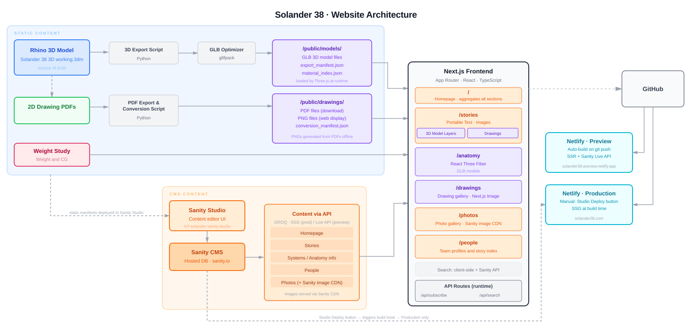

# Solander 38 website
Codebase for both the website CMS and UI/front end. Using https://github.com/sanity-io/sanity-template-nextjs-clean as template.

<!--  -->

### CMS (Sanity Studio)
[/studio/](/studio/) — [README](studio/README.md)

https://rising-tide.sanity.studio

### Front end (Next.js/React)
[/frontend/](/frontend/) — [README](frontend/README.md)

### Deployments

Two separate Netlify sites share the same codebase and Sanity dataset but behave differently based on `NEXT_PUBLIC_PREVIEW_SITE`.

| | Preview | Production |
|--|---------|------------|
| Site | https://solander38-preview.netlify.app | https://solander38.netlify.app |
| Build trigger | git push (auto) | Manual — Studio Deploy tool |
| Content | Published | Published |
| Content freshness | SSR on every request + Sanity Live API (SSE) | SSG at build time |
| `NEXT_PUBLIC_PREVIEW_SITE` | `true` | _(not set)_ |

**There is no automatic webhook from Sanity to Netlify.** Production content only updates when a build is manually triggered from the Studio's Deploy tool (which calls a Netlify build hook). The preview site rebuilds on every `git push` and shows live draft content without a rebuild via the Sanity Live API.

---

### Python scripts
[/scripts/](/scripts/) — [README](scripts/README.md)

Post-export pipeline: GLB optimization, material extraction, PDF-to-PNG conversion, manifest copying, and Sanity reference audit.

---

### License

© 2025-2026 Rising Tide Research Foundation. This repository is dual-licensed.

| | License | Covers |
|--|---------|--------|
| **Code** | [MIT](LICENSE) | Everything in `frontend/app/`, `frontend/sanity/`, `studio/`, and `scripts/`: the Next.js front end, the Sanity Studio and schemas, and the Rhino export/optimization pipeline |
| **Content & 3D assets** | [CC BY 4.0](LICENSE-CC-BY-4.0) | Everything under `frontend/public/`: the exported GLB models (`models*/`, `models-jig*/`), technical drawings, photographs, logos, and generated manifests — and all editorial content authored in Sanity (stories, captions, component data) |

Both licenses require attribution: credit **Rising Tide Research Foundation** and link back to this repository or https://solander38.com.

Third-party assets are excluded from the above and retain their original licenses — notably the HDRI environment maps in `frontend/public/hdri/` ([Poly Haven](https://polyhaven.com), CC0) and the `gltfpack` binary in `scripts/` ([meshoptimizer](https://github.com/zeux/meshoptimizer), MIT).
